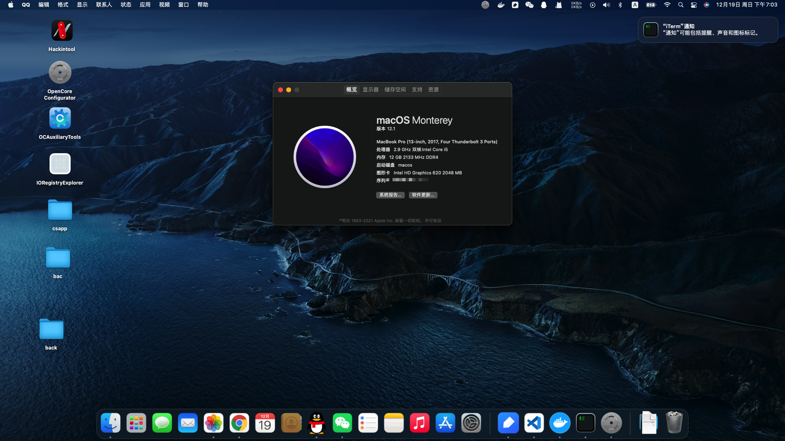

# asus-fl5900u-hackintosh-oc

## OpenCore Version

- 0.7.7

## MAC OS Version

- Big Sur 12.01~12.2 (All versions are supported!)

PS: 11.0 + 需要替换intel网卡驱动(11/12的驱动版本互不兼容，虽然能进系统，但是时间非常长,默认版本为当前版本驱动)

[Intel网卡驱动下载地址](https://github.com/OpenIntelWireless/itlwm) 选择对应版本进行下载，然后替换Kext目录下的同名文件

- 默认版本为Brcm版本

Intel network (config-intel.plist)
Brcm (config.plist)

[EFI下载地址](https://github.com/blankqwq/asus-fl5900u-hackintosh-oc/releases)

## Laptop Specifications

| Name              | Specifications                                               |
| ----------------- | ------------------------------------------------------------ |
| Processor         | Intel Core i7 - 7500U                                        |
| Memory            | 4+8 GB DDR4 2133 Mhz                                         |
| Storage           | SSD 128G                                                     |
| Video             | Integrated Intel HD 620 + NVIDIA 940MX                       |
| Wi-Fi + Bluetooth | Brcm 943224(Airdrop ok) or Intel 8260(bluetooth&&wifi ok) or  |
| Ethernet          | Realtek RTL8111                                              |
| Audio             | Realtek ALC255                                               |
| Touchpad          | ELAN 1000 I2C Interface                                      |
| Screen Size       | 15,6 Inch                                                    |
| Screen Resolution | 1920 x 1080                                                  |
| Others            | 1x Card Reader, 1x WebCam, 1x VGA Port, 1x HDMI, 1x Combo Audio Jack, 1x USB 2.0, 1x USB 3.0 Type A, 1x USB 3.0 Type C, 1x Optical Drive |

## What Works 

✅ Intel HD 620

✅ All USB Type A ports

✅ USB type C port

✅ Keyboard

✅ Touchpad (It works great now!)

✅ Internal screen backlight change

✅ Wi-Fi (You'd better to buy a new one like Intel's or a real one on Mac Book!)

✅ UVC HD Webcam

✅ Speaker

✅ Laptop lid

✅ Sleep (Fixed!But not stable,you'd better not use sleep!)

✅ Native power managment

✅ Battery status

✅ Bluetooth

✅ IServices (IMessage, FaceTime, ICloud) (Make sure you set your own SMbios and generate your own Serial Number using GenSMBIOS)

✅ Onboard Ethernet

✅ FN Keys

⚠️ SD Card (Not Tested)

✅ VGA/HDMI (Audio + Video)

❌ Realtek SD card reader

❌ NVIDIA GeForce 940MX (Optimus - impossible to get working at the moment)

## Thanks

- 感谢以下项目的作者/团队
[rjm521](https://github.com/rjm521/asus-fl5900u-hackintosh-oc)
[hjh70526](https://github.com/hjh70526/asus-fl5900u-hackintosh-oc/)
[OpenCorePkg](https://github.com/acidanthera/OpenCorePkg)
